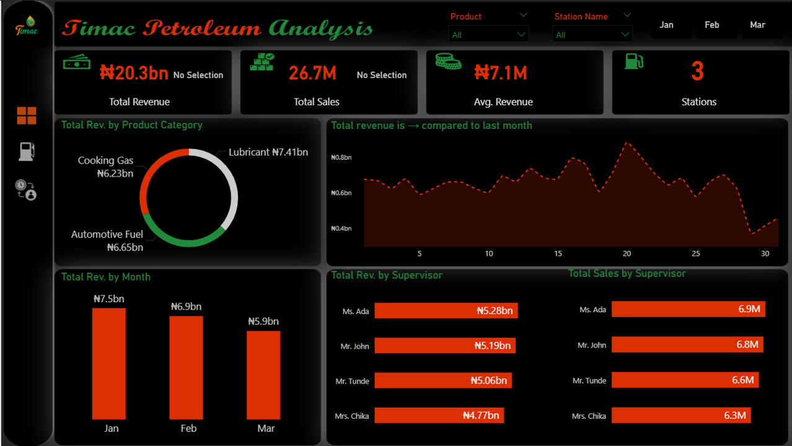
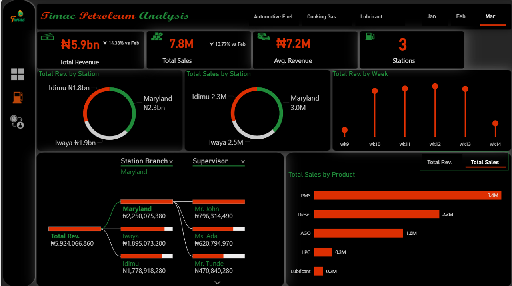
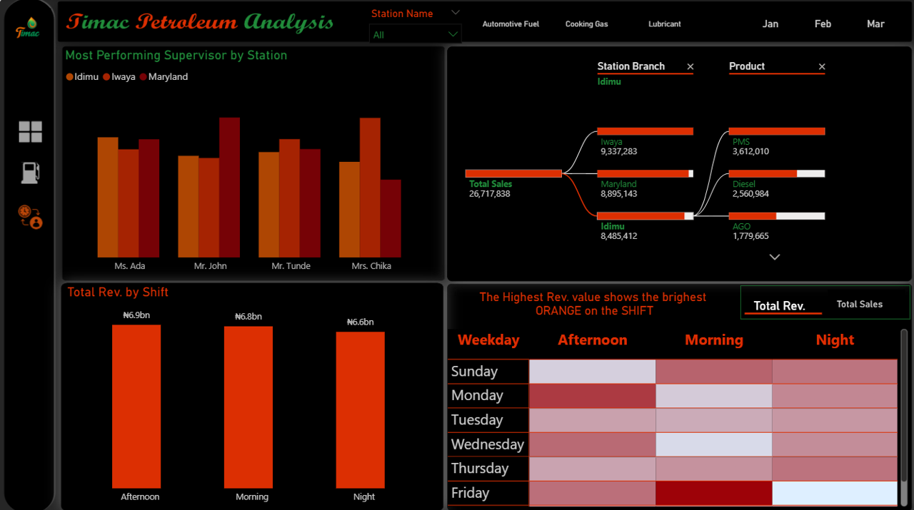

# Petroleum-Analysis-Dashboard
Timac a Petroleum Company That own Fuel Stations In Three Cities Across the Region/Country

# Timac Petroleum Analysis Dashboard

## Business Insights & Strategic Recommendations

---

## Portfolio Description

This project showcases my ability to transform raw petroleum sales data into **actionable business insights using Microsoft Power BI**.

I designed and developed an interactive dashboard that analyzes:
- Revenue and sales performance trends
- Product-level profitability
- Station and supervisor performance
- Time-based sales patterns (daily, weekly, shifts)

The goal of this project is to demonstrate **end-to-end Business Intelligence skills**, including:
- Data modeling
- DAX calculations
- Data visualization
- Executive-level insight generation

This solution is tailored for **decision-makers and stakeholders**, enabling them to quickly identify performance gaps, optimize operations, and drive revenue growth.

---

## Dashboard Screenshots

### 🔹 Overview Dashboard

### 🔹 Station & Product Analysis

### 🔹 Supervisor & Shift Performance

>  *Note: Add your screenshots to an `/images` folder in your repository and update file names if needed.*

---

## Executive Summary

The Timac Petroleum dashboard provides a consolidated view of **₦20.3bn total revenue** generated from **26.7M total sales** across **3 stations**.

Despite strong overall performance, key insights reveal:

-  Declining revenue trend (Jan → Mar)
-  High dependency on a few key products
-  Uneven station performance
-  Clear operational patterns across shifts and weekdays

---

## Revenue & Sales Performance Trends

### Key Findings:
- **Jan:** ₦7.5bn  
- **Feb:** ₦6.9bn  
- **Mar:** ₦5.9bn *(↓ ~21% from Jan)*  

- March performance:
  - Revenue: **₦5.9bn (↓14.38% vs Feb)**
  - Sales: **7.8M (↓13.77% vs Feb)**  

### Insight:
Revenue decline suggests **demand contraction or operational inefficiencies**

### Recommendations:
- Optimize pricing strategy
- Introduce loyalty programs
- Boost end-of-month sales campaigns

---

## Product Performance Analysis

### Revenue Contribution:
- **Lubricants:** ₦7.41bn *(High margin)*
- **Automotive Fuel:** ₦6.65bn  
- **Cooking Gas:** ₦6.23bn  

### Sales Volume:
- PMS dominates with **3.4M sales**

### Insight:
- Lubricants = high margin, low volume
- PMS = high volume dependency

### Recommendations:
- Upsell lubricants
- Promote LPG adoption
- Bundle fuel + lubricant offers

---

## Station Performance

- **Maryland:** Top performer (₦2.3bn)
- **Idimu:** Lowest performer

### Recommendations:
- Replicate Maryland strategy
- Improve operational efficiency in low-performing stations

---

## Supervisor Performance

- **Ms. Ada:** Top performer
- Balanced performance across team

### Recommendations:
- Introduce KPI-based incentives
- Share best practices

---

## Time-Based Insights

- Peak weeks: **Week 10–13**
- Best shift: **Afternoon**
- Best day pattern: **Fridays**

### Recommendations:
- Allocate more resources to peak periods
- Introduce night shift incentives

---

## Key Risks

- Declining revenue trend  
- Over-dependence on PMS  
- Underperforming stations  
- Underutilized night operations  

---

## Strategic Recommendations

- Diversify product revenue streams  
- Optimize staffing and operations  
- Implement performance tracking KPIs  
- Leverage data for decision-making  

---

## Conclusion

This dashboard highlights critical opportunities to:
- Improve revenue performance  
- Optimize operations  
- Drive strategic growth  

---

## Tools Used

- Microsoft Power BI  
- DAX (Data Analysis Expressions)  
- Data Modeling  

---

## Project Purpose

To build a **data-driven petroleum analytics solution** that supports:
- Operational efficiency  
- Revenue growth  
- Strategic decision-making  

---
